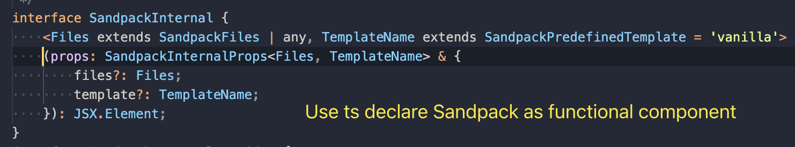
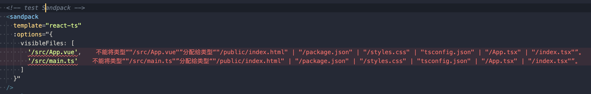
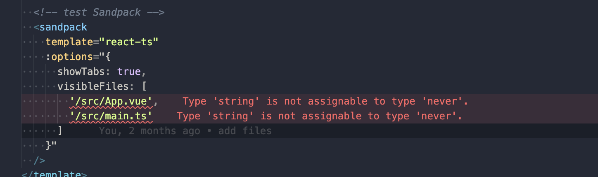

# volar issue with functional component

> open src/App.vue check the effect

When use volar latest version. Ts static checker not work.

- functional component

  > see src/components/List.tsx

## issue two description

It worked with volar@0.40.x. Like that:

**But latest volar not work.**

