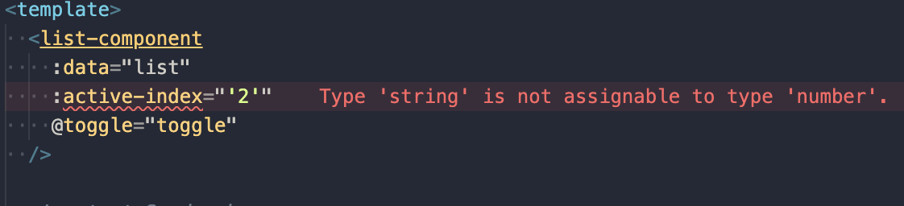
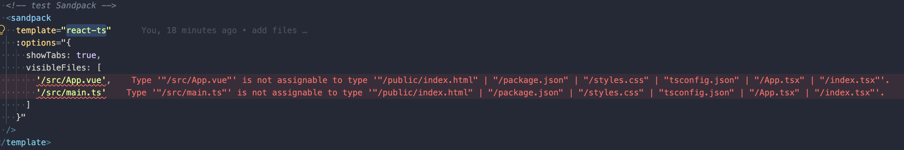

# volar issue with functional component

> open src/App.vue check the effect

## issue one description

> it is a basic functional component

When use volar latest version. Ts static checker not work.

**but volar@0.40.x worked.**

### functional component

> see src/components/List.tsx

## use it

> see src/App.vue

## issue two description

It worked with volar@0.40.x. Like that:

**But latest volar not work.**

